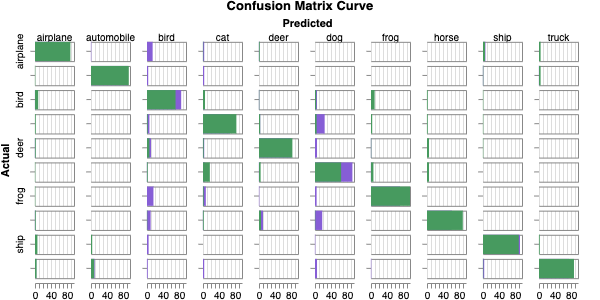
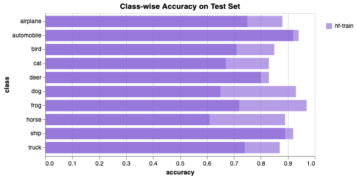

# HF Evaluation (ResNet-18 on CIFAR-10 Subset)

## How to build

```bash
docker build -t run_eval_minor_hf:v1_eval -f Dockerfile.eval .
docker build -t run_eval_minor_hf:v1_train -f Dockerfile .
```

## How to run:

```bash
docker run run_eval_minor_hf:v1_eval
docker run run_eval_minor_hf:v1_train -e HF_TOKEN=<HF_TOKEN>
```

## Links

- HF Model: https://huggingface.co/gjyotin305/minor_resnet18/tree/main
- W&B Report: https://wandb.ai/gjyotin1724/cifar10-resnet18/reports/Hugging-Face-Question-2-Minor-B22AI063--VmlldzoxNTk5NTE4NA?accessToken=e1dikprz1hnesvfhtrds7pgnclgdcqhps4shr5psla44zvcw6q7uhluutlr1kgqb

## Evaluation Run Logs

```text
Generating train split: 100%|██████████| 5000/5000 [00:00<00:00, 125528.35 examples/s]
Generating validation split: 100%|██████████| 500/500 [00:00<00:00, 151594.04 examples/s]
Generating test split: 100%|██████████| 1000/1000 [00:00<00:00, 275198.74 examples/s]
Eval split: test (1000 samples)
/usr/local/lib/python3.10/site-packages/torchvision/models/_utils.py:208: UserWarning: The parameter 'pretrained' is deprecated since 0.13 and may be removed in the future, please use 'weights' instead.
  warnings.warn(
/usr/local/lib/python3.10/site-packages/torchvision/models/_utils.py:223: UserWarning: Arguments other than a weight enum or `None` for 'weights' are deprecated since 0.13 and may be removed in the future. The current behavior is equivalent to passing `weights=None`.
  warnings.warn(msg)
Downloading: "https://huggingface.co/gjyotin305/minor_resnet18/resolve/main/setB.pth" to /root/.cache/torch/hub/checkpoints/setB.pth
100%|██████████| 42.7M/42.7M [00:08<00:00, 5.54MB/s]
Model loaded from HF URL.
Evaluating: 100%|██████████| 4/4 [00:14<00:00,  3.66s/batch, loss=0.6689, acc=79.1000]
```

## Final Metrics

| Metric | Value |
| --- | --- |
| Final Eval Loss | **0.6689** |
| Final Eval Accuracy | **79.10%** |
| Final Eval Macro F1 | **0.7954** |

## Confusion Matrix

```text
[[75  1 14  3  1  0  0  0  6  0]
 [ 0 92  3  3  0  0  0  0  1  1]
 [ 2  0 85  4  1  5  3  0  0  0]
 [ 0  0  6 67  3 24  0  0  0  0]
 [ 1  0 10  3 80  5  1  0  0  0]
 [ 0  0  1  4  1 93  1  0  0  0]
 [ 0  0 16  7  1  4 72  0  0  0]
 [ 1  0  9  1 10 18  0 61  0  0]
 [ 3  0  4  0  0  1  0  0 92  0]
 [ 3  9  2  3  0  5  1  0  3 74]]
```

## Class-wise Accuracy

| Class | Accuracy |
| --- | --- |
| airplane | 75.00% |
| automobile | 92.00% |
| bird | 85.00% |
| cat | 67.00% |
| deer | 80.00% |
| dog | 93.00% |
| frog | 72.00% |
| horse | 61.00% |
| ship | 92.00% |
| truck | 74.00% |

## Visualizations

### Confusion Matrix



### Class-wise Accuracy Bar Graph



## Classification Report

```text
              precision    recall  f1-score   support

    airplane       0.88      0.75      0.81       100
  automobile       0.90      0.92      0.91       100
        bird       0.57      0.85      0.68       100
         cat       0.71      0.67      0.69       100
        deer       0.82      0.80      0.81       100
         dog       0.60      0.93      0.73       100
        frog       0.92      0.72      0.81       100
       horse       1.00      0.61      0.76       100
        ship       0.90      0.92      0.91       100
       truck       0.99      0.74      0.85       100

    accuracy                           0.79      1000
   macro avg       0.83      0.79      0.80      1000
weighted avg       0.83      0.79      0.80      1000
```
